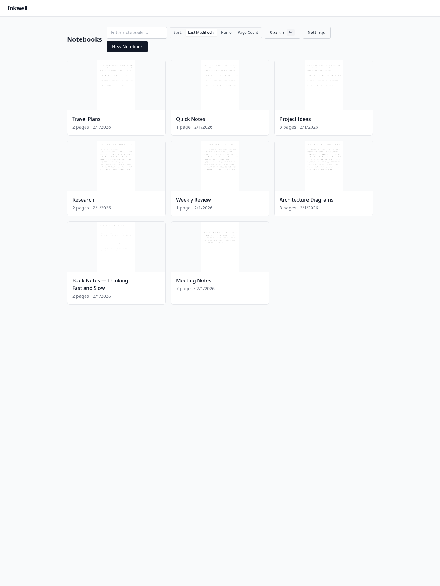
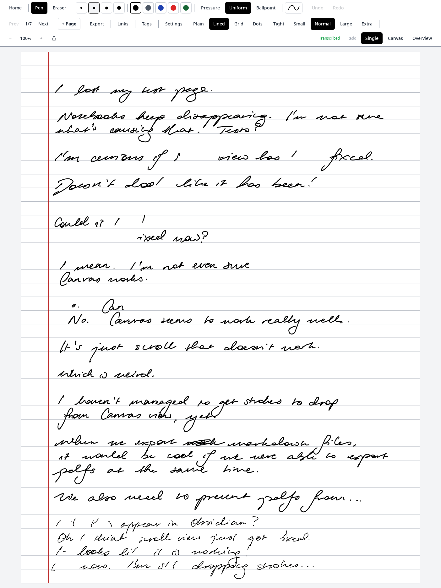
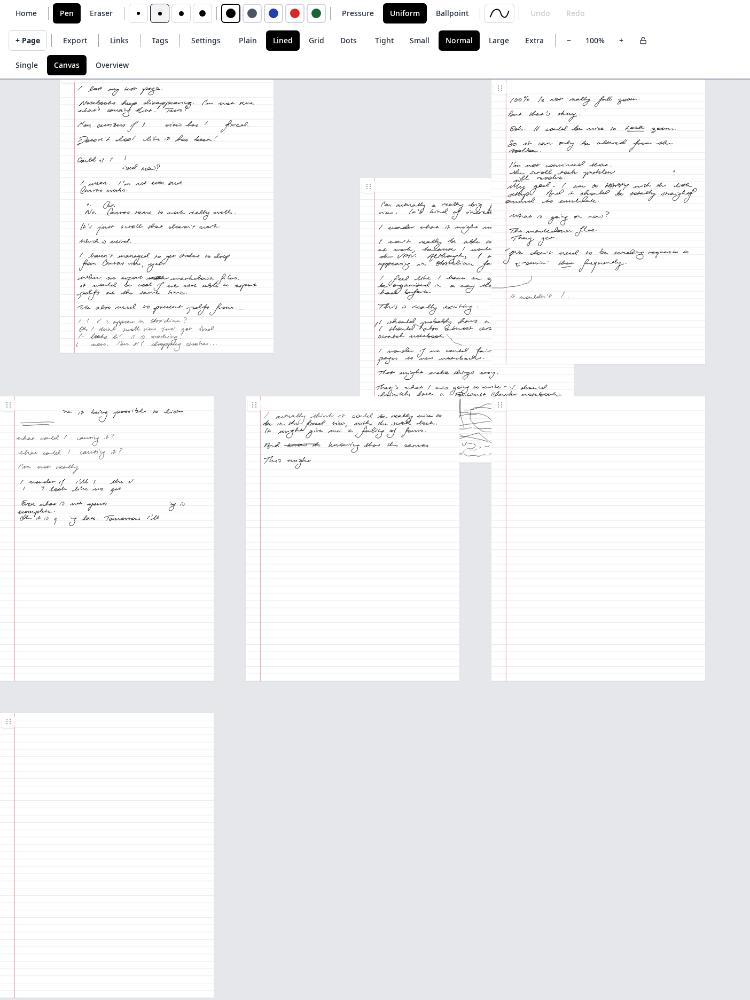
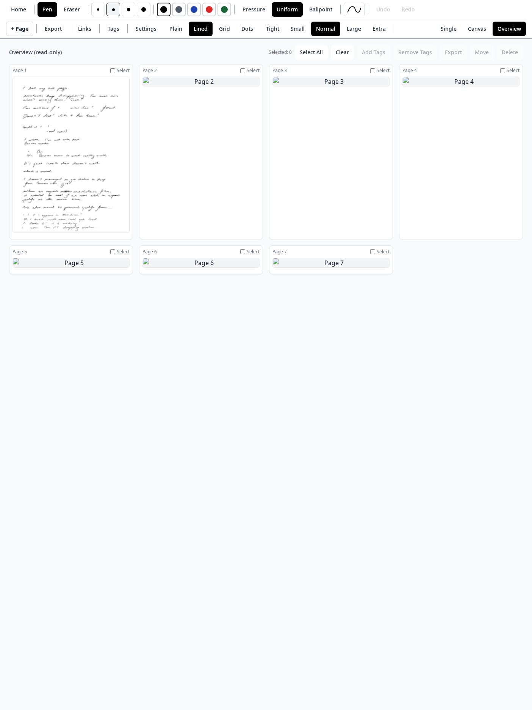
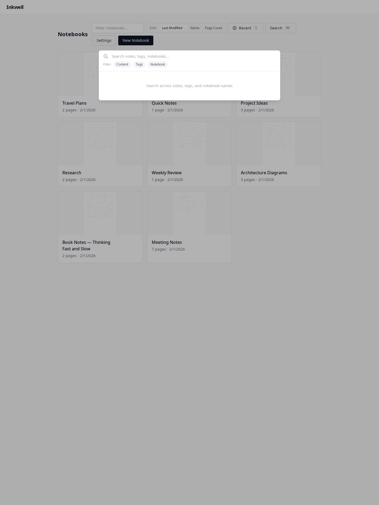

# Inkwell

A self-hosted handwriting application for e-ink devices. Captures handwritten notes to an infinite canvas, with automatic transcription via Gemini and local file storage.



## What it does

Inkwell is a web app that runs on a local server and is accessed via a browser on an e-ink tablet (primarily Boox devices). It provides a writing surface for capturing handwritten notes, organised into notebooks containing pages arranged on a 2D infinite canvas.

The application uses [boox-rapid-draw](https://github.com/sergeylappo/boox-rapid-draw) for low-latency inking on Boox devices. This Android app intercepts stylus input and renders strokes directly to the e-ink layer, providing instant visual feedback. Inkwell receives the stroke events through standard pointer events and persists them to the filesystem.

It would likely work on other devices and browsers, but the drawing experience without boox-rapid-draw will have noticeable latency on e-ink displays.

## Views

### Single page view

The main writing interface. Strokes are rendered with pressure sensitivity using Perfect Freehand.



### Canvas view

All pages arranged spatially on a 2D infinite canvas. Pan and zoom to navigate. Drag pages to reposition them.



### Overview view

Grid-based page management. Select multiple pages for bulk operations (tagging, export, move, delete).



### Search

Full-text search across transcriptions. Open with the Search button or Cmd+K.



## Features

- Notebooks containing pages on a 2D canvas
- Pen, highlighter, and eraser tools with pressure sensitivity
- Multiple stroke widths and colours
- Page backgrounds: plain, lined, grid, dots
- Automatic transcription via Gemini API
- Full-text search across transcriptions
- PDF and PNG export
- Page tags and links
- Inline handwriting links (cross-notebook + external URLs)
- Markdown sync to external directories (e.g. Obsidian vault)
- Offline support via service worker

## Setup

### Requirements

- Node.js 20+
- A Gemini API key (for transcription)

### Installation

```bash
git clone https://github.com/yourusername/inkwell
cd inkwell
npm install
```

### Configuration

Create a `.env` file in the project root:

```bash
GEMINI_API_KEY=your_api_key_here
DATA_DIR=/path/to/store/notebooks  # optional, defaults to ./data
PORT=3001                          # optional, server port
HOST=0.0.0.0                       # optional, bind address
AUTO_TRANSCRIBE=true               # optional, auto-transcribe pages
TRANSCRIBE_DELAY_MS=30000          # optional, delay before auto-transcribe
```

### Running

Development mode (with hot reload):

```bash
npm run dev
```

This starts both the server (port 3001) and client dev server (port 5173).

Production build:

```bash
npm run build
npm run start --workspace=server
```

Serve the built client files from `client/dist` using the server's static file serving, or a separate web server.

## Network setup (Tailscale example)

I run Inkwell on my desktop PC and access it from my Boox tablet over Tailscale. This avoids exposing the server to the internet while allowing access from anywhere on my Tailscale network.

1. Install Tailscale on both the server machine and the Boox tablet
2. Start Inkwell on the server with `HOST=0.0.0.0`
3. On the Boox, open Chrome and navigate to `http://<tailscale-ip>:3001`

The server binds to `0.0.0.0` by default, so it will be accessible on all network interfaces including Tailscale.

If running the client dev server separately, you'll need to configure Vite to allow external connections and point it at the server. For production, build the client and serve it from the server's static file handler.

## Using with boox-rapid-draw

1. Install [boox-rapid-draw](https://github.com/sergeylappo/boox-rapid-draw) on your Boox device
2. Configure it to overlay Chrome
3. Open Inkwell in Chrome
4. Enable the overlay before writing

boox-rapid-draw intercepts stylus input and draws directly to the e-ink framebuffer, bypassing the browser's rendering pipeline. This eliminates the latency that makes writing on e-ink displays frustrating. Inkwell still receives the pointer events and saves the strokes to the server.

## Data storage

All data is stored as JSON files on the filesystem:

```
/data/inkwell/
├── config.json
└── notebooks/
    └── {notebook-id}/
        ├── meta.json
        └── pages/
            └── {page-id}/
                ├── meta.json
                ├── strokes.json
                ├── transcription.md
                └── thumbnail.png
```

This makes backup simple (rsync the directory) and the data is easily inspectable and greppable.

## API

The server exposes a REST API at `/api` and a WebSocket endpoint at `/ws` for real-time updates. See PLAN.md for the full API specification.

## Development

```bash
# Run tests
npm test

# Run e2e tests (requires server running)
npm run test:e2e

# Run all tests
npm run test:all
```

## License

MIT
